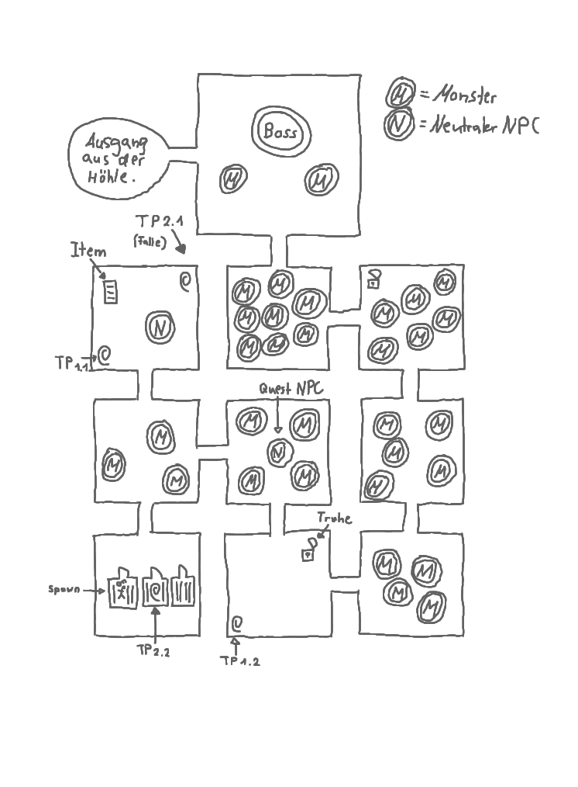
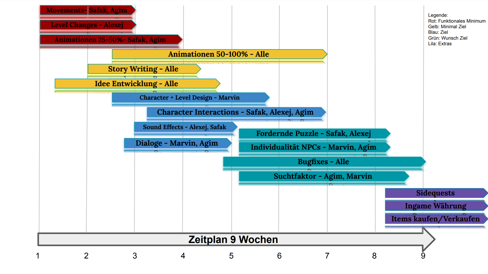

### Titel: Silent Soul

#### 1.Spielbeschreibung 

Aufgabe des Spieles ist es, dass sich der Spieler durch mehrere Level (Räume) kämpft, um am Ende schließlich zum Endgegner zu gelangen. Auf dem Weg dahin kann der Spieler Puzzle lösen und seine Ausrüstung verbessern, in jedem Raum gibt es andere Herausforderungen und zufällige Item drops.
Der Game-Run kann nach dem erfolgreichen Besiegen des Endgegners wiederholt werden, bei jeder Iteration verbessern sich die Stärkelevel der Gegner. Das Suchtpotenzial liegt darin, dass der Spieler sich immer weiter verbessern kann und der skill cap deshalb sehr hoch ist.
Aus dem oben genannten Konzept ergibt sich auch, dass es keinen auswählbaren Schwierigkeitsgrad im Spiel gibt. Wenn der Spieler allerdings schon einmal bspw. 5 game-runs am Stück geschafft hat, kann er beim nächsten Versuch direkt auf einer höheren Stufe starten. Die Ausrüstung wird bei jedem neuen game-run zurückgesetzt.
 
Items und Inventar im Spiel:
Der Spieler besitzt ein Inventar, in welchem er gefundenen Gegenstände wie z. B. Waffen und Lebens tränke sammeln kann. Das Inventar des Spielers hat keine Begrenzung, die Anzahl der ausgerüsteten Gegenstände allerdings schon, so können maximal 5 Gegenstände gleichzeitig ausgerüstet sein.
 
Details zu Charakteren im Spiel:
Spieler: ist ein Held mit Nah- und Fernangriff (Schwert und Projektil Waffe), Bewegungen sind links, rechts, hoch, runter, seitlich. Rollen zum Ausweichen der feindlichen Angriffe sollen auch implementiert werden. Es sind keine Character Modifizierungen möglich.
Npcs:
Einfache Monster: Nah- und Fernangriffe, schwache Angriffs- und Verteidigungswerte, bewegen sich langsamer als Spieler und spawnen bedingt zufällig.
Endgegner:  Starke Nahangriffe, langsame Bewegung, besitzt Schwachstellen, Model deutlich größer als Spieler
Neutrale NPCs: Geben durch Positionierung und Dialogboxen Hinweise zum Lösen der Puzzles oder sind Quests für Spieler.
 

Leben und Energie Management:
Der Charakter hat ein Leben und einen Energiebalken, diese befinden sich beim Start auf 100 %. Durch Rollen und Angriffe verliert der Spieler Energie und muss darauf warten, bis er sich von selbst wieder regeneriert. Durch feindliche Angriffe verliert der Spieler an Lebenspunkte und kann diese nur durch Tränke wieder nachfüllen (keine automatische Regeneration der Lebenspunkte über Zeit). Energie und Lebens tränke lassen sich in Räumen finden.
 
Storyline:
Der Spieler spawnt in einer Gefängniszelle unter der Erde. Eine Dialogbox erscheint, der Spielercharakter erklärt im Monolog, dass er den Ausgang aus der Höhle finden muss. Zufälligerweise liegt vor ihm ein Schlüssel auf dem Boden, mit dem sich die Gefängnistür einfach öffnen lässt (hier lernt der Spieler gleich das Inventar und die Funktionstaste kennen (Tutorial)). Öffnet der Spieler die Tür, startet der game-run. 

Jetzt muss der Spieler alle Monster besiegen, um die nächsten Räume betreten zu können. Wählt der Spieler den Raum über sich, ändert sich die Storyline im Vergleich zum Raum rechts, beide Räume führen aber zum Ausgang der Höhle.

Schließlich muss der Spieler den Bossraum betreten und den Endgegner besiegen, im Anschluss öffnet sich der Ausgang aus der Höhle links vom Raum und der game-run ist erfolgreich beendet.

Skizze der Map:

Allgemeines Setting:
Dunkle Räume und düstere Hintergrundmusik, rätselhafte Stimmung. NPCs sind aggressive Monster.
Der Charakter soll sich im Spiel verfolgt und paranoid fühlen, das wird durch die Dialoge mit den neutralen NPCs unterstrichen.
Grafik Assets sollen im Pixel Art style bzw. niedriger Auflösung sein.

#### 2.Technische Elemente

Das Spiel soll roguelike werden und grid based movement implementieren. Die Sicht ist schräg aus der Vogelperspektive in 2D. In der Mitte des Bildschirms befindet sich immer der Charakter, die Kamera folgt ihm also. Die Steuerung ist mittels der Pfeiltasten oder W-A-S-D möglich, zudem gibt es zwei weitere Tasten für Nah- und Fernangriffe, eine Taste für das Item-menü, eine Taste zum Rollen(ausweichen) und eine Taste (Enter) zum Auswählen von Gegenständen im Inventar und zum Bestätigen der Dialoge. Eine Maus wird nicht zum Spielen benötigt. Eine Dialogbox erscheint bei Events im unteren mittleren Bereich des Bildschirms.

#### 3. "Big Idea"

Die meisten Roguelike Spiele bauen darauf auf, den eigenen Charakter über einen längeren Zeitraum zu verbessern, deshalb sind die game-runs sehr lange. Ein game-run in unserem Spiel dauert nur bis zu 10 Minuten. Hier geht es eher darum, sich die Fähigkeiten, die Bewegung der Gegner und die Puzzles zu merken, um beim nächsten game-run gegen die gleichen Gegner mit höheren Werten ankommen zu können (speedrun ähnliche Mechaniken).  

#### 4. Entwicklungszeitplan

###### Funktionales Minimum:

Movements: Safak Altundag, Agim Bajrami

Level Changes: Alexej Freund

Animationen: Safak Altundag, Agim Bajrami

###### Minimalziel:

Animationen: Alle

Story Writing: Alle

Idee Entwicklung: Alle

###### Ziel:

Character + Level Design: Marvin Tiele

Character Interactions: Safak Altundag, Alexej Freund, Agim Bajrami

Sound Effects: Alexej Freund, Safak Altundag

Dialoge: Marvin Tiele, Agim Bajrami

###### Wunschziel:

Fordernde Puzzle: Safak Altundag, Alexej Freund

Individualität der NPC’s: Marvin Tiele, Agim Bajrami

Bugfixes: Alle

Suchtfaktor: Agim Bajrami, Marvin Tiele

###### Extras:

Sidequests: Alle

Ingame Währung: Alle

Items kaufen/verkaufen: Alle

#### 5. Teamaufteilung

Designer: Alexej Freund, Marvin Tiele, Safak Altundag, Agim Bajrami

Programmierer: Safak Altundag, Agim Bajrami, Alexej Freund

Produzent: Safak Altundag

Künstler: Marvin Tiele

QS: Agim Bajrami
