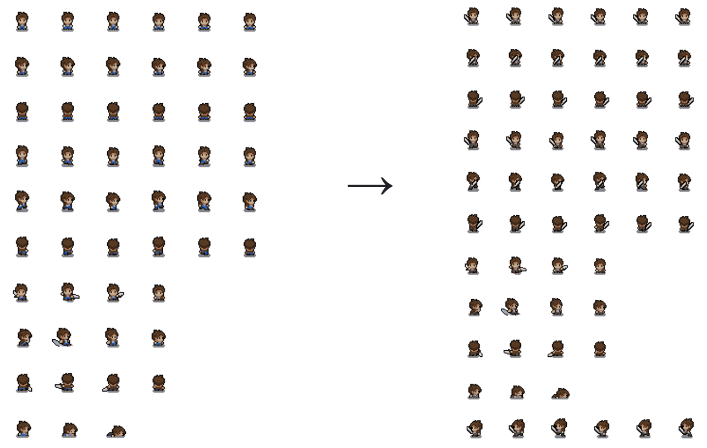
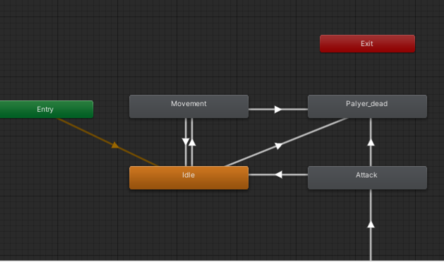

### Alpha Release: Silent Soul

Zum Zeitpunkt des Alpha Releases haben wir unser eigentliches Ziel in Layer 3 erreicht, lediglich Soundeffekte wurden noch nicht implementiert, da wir diese im Laufe der Entwicklung als für unser Spiel nebensächlich neu eingeschätzt und deshalb in Layer 4 verschoben haben.
 
Früh in der Entwicklung haben wir festgestellt, dass sich unser Konzept mit dem grid based movement schlecht implementieren lässt und die meisten Online Sprite Sheets auf diagonales movement ausgelegt sind, aus diesem Grund haben wir uns dazu entschieden das Konzept zu verwerfen.
 
Eine weitere Herausforderung war das Animieren und Umsetzen der Nahangriffe zwischen Spieler und NPC’s, dieser Teil nahm viel Zeit in Anspruch . Im Laufe der Entwicklung haben wir uns deshalb dazu entschieden, die Fernangriffe des Spielers noch nicht einzubauen (eine Sache besonders gut machen).
 
Die Implementierung von UI-Elementen hingegen hat reibungslos funktioniert und wenig Zeit in Anspruch genommen, sodass wir ein Menu, Pause und GameOver Screen, eine Healthbar sowie Dialoge einbauen konnten.
 
Auch das Bearbeiten und Animieren von Sprites hat gut funktioniert, aber trotzdem viel Zeit in Anspruch genommen. Beispiel eines bearbeiteten Spritesheets:

White Knight Sprite und Animation: 

  
Ein weiterer Punkt, der bei uns starke Umpriorisierung erfahren hat, ist das Inventar des Spielers. Wir haben diesen Punkt zwar im „Extra“- Layer eingeordnet, wollten aber ursprünglich eine einfache Version bereits früher eingebaut haben. Dies haben wir nach der Entscheidung, dass wir die Fernangriffe noch nicht einbauen, aufgeschoben.
 
Probleme gab es außerdem bei der Hitbox des White Knights, durch das einfügen eines Rigidbody, haben wir zwar eine Hitbox für den White Knight erschaffen, jedoch war, diese stetig Aktiviert und dem Player wurde jedes Mal Schaden zugefügt, obwohl dieser nur gegen den White Knight läuft. Des Weiteren gab es Probleme mit dem Anvisieren des Main Characters. Die gespawnten Gegner hatten keine Links-Animations zum Angreifen. Das Problem haben wir gelöst, indem wir über den spriteRenderer.flipX überprüfen, ob die X Koordinate direction vom Player kleiner 0 ist und dann in der Animation geflippt. Durch gezielte If-Abfrage haben wir dann geprüft, ob der White Knite schaden nimmt:

Der Boss DeathBoy69:

Beim Boss haben wir zunächst das Movement vom White Knight wiederverwendet (wird in einer späteren Version überarbeitet) und ihm eigene Animationen bezüglich seines Todes, sowie seiner Angriffe gegeben. 

Main Character Sprite und Animations:

Probleme beim Charakter gab es bei den Idle Animationen. Beim Stehen bleiben hat der Charakter nicht in die Richtung geschaut, in die er zuletzt gelaufen ist. Das haben wir mit den Werten „Last Horizontal” und „Last Vertical” gelöst. Die Letzten Vertikalen oder Horizontalen Koordinaten werden überprüft und dementsprechend werden die richtigen Animationen abgespielt.

