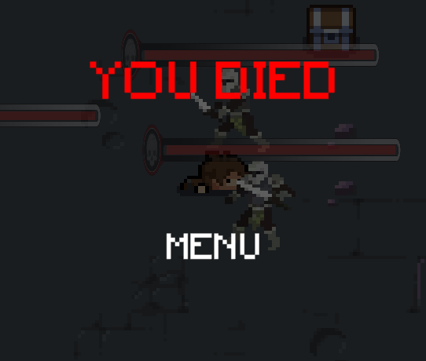

# Conclusion

## Das finale Spiele in screenshots:

### Vom Entwurf bis zum finalen Release, die Karte des Spiels:

 

### Item drops:

 

### Dialoge:

### Healthbar und Inventar:

 

### Interaktive Umgebung - sich Oeffnende Tueren:

### Gameover- und win screen:

 

### Kaempfe mit Gegnern:

 

## Aenderungen seit dem Playtesting:

Das Feedback des playtesting hat ergeben, dass Spieler mit dem Kampfsystem unzufrieden waren. Ausserdem wurde das fehlen eines Inventar haeufig bemaengelt.

Die neusten Aenderungen sind deshalb eine ueberarbeitung des alten Codes, damit die Collisions zwischen Spieler und Gegner besser erkannt werden, und das einfuehren eines kleinen Inventars, in welchen vom Spieler 
aufgehobene Gegenstaende enthalten sind: 

Zudem haben wir auch basierend auf dem feedback einen win screen eingebaut, dieser erscheint wenn das Spiel erfolgreich beendet wurde.

Weitere Aenderungen sind kleine Ueberarbeitungen der Collisionbox des hauptcharacters da dieser bei unpraezisen laufen an den umgebenen Texturen festhaengen konnte und die Anpassung der Lebenspunkte von Spieler und NPC's.
Auch der Staerkegerad von Items wurde angepasst.

## Allgemeines zum Entwicklungsverlauf:

a) *Wie gut ließen sich ihre anfänglichen Ideen in das finale Spiel umsetzen?Konnten Sie ihren Zeitplan einhalten?* 
Wir konnten viele der urspruenglich im Entwicklungszeitplan notierten Ziele erreichen. Da wir im laufe des Projektes zwei Gruppenmitglieder weniger wurden konnten wir unser Wunschziel allerings nicht erfüllen.

b) *Wo sind sie stark davon abgewichen?*
Starke Abweichung von der urspruenglichen Idee gab es beim "Storywriting", wir hatten geplant Raetsel und Quests in die Raeume zu bauen, dies wir aufgrund der Komplexitaet und umgewichtung der Prioritaeten allerdings nicht gemacht und stattdessen
nur in einigen wenigen Raeumen kleine easter eggs eingebaut.

c) *Wie haben die Elemente des Kurses (Entwicklungsplan, Prototyp, Playtesting etc.) das Fortkommen im Kurs beguenstigt oder behindert?*

Der Entwicklungszeitplan hat uns bei der umsetzung durchgehend geholfen da wir durch ihn wussten, wo wir uns gerade befinden und auf welche Elemente in diesem Augenblick ein starkerer Fokus gesetzt werden sollte.

Das Playtesting hat uns Einblicke aus anderen Perspektiven geboten und die Maengel am Spiel die wir selbst bereits hatten bestaetigt, so wussten wir genau auf welche Bereiche wir uns fuer die letzte Phase fokusieren mussten.

d) *Konnten Sie ihre Erwartungen umsetzen? Sind sie stolz auf das Spiel?*

Wir konnten die wichtigsten Elemente umsetzen und sind im ganzen mit dem Spiel sehr zufrieden.

e) *Hatten Sie genug Zeit?*

Anfaenglich als die Gruppe noch geformt wurde, gab es etwas Zeitprobleme. Mit der Zeit und als die Gruppe feststand hat sich dieses Problem gelegt und wir konnten uns ausschliesslich auf das Spiel konzentrieren.

f) *Was war die groesste technische Schwierigkeit?*

Git, trotz dem gebrauch von branches haben wir immer wieder lokale backups aufspielen muessen und Fortschritt verloren.

g) *Sind sie mit dem Thema des Kurses klar gekommen?*

Wir haben uns wenig auf das Thema "Game logic" konzentriert sondern darauf ein stimmiges Spiel zu erstellen.

h) *Hat Ihnen die Arbeit mit dem Thema Spass gemacht, oder haetten Sie lieber mehr Freiheit gehabt?*

Wir haette lieber mehr Freiheit gehabt, aber da wir selbst einen geringen Fokus auf das Thema gelegt haben, hat es uns nicht sehr eingeschraenkt.

i) *Was wuerden Sie bei ihrem naechsten Spiel anders machen?*

Die Strukturierung des gesamten Projekts und vorallem des Codes. Es ist im nachhinein schwer Aenderungen durchzufuehren.

j) *Was war der groesste Erfolg waehrend des Projekts? War das Projekt ein Erfolg?*

Der groesste Erfolg des Spiels ist die interaktion beim Kampf mit den Gegnerischen NPC's, sie ist uns sehr gut gelungen.

k) *Mochten Sie Unity?*

Ja, die Nutzung ist sehr intuivitv und das Programm performant. Man lernt das Programm schnell kennen und es gibt zahlreiche tutorials zu fast allem was man umsetzen möchte. 
Des Weiteren gab es auch viele Lösungsvorschläge zu Problemen. Somit konnte man gut mit Unity arbeiten.
